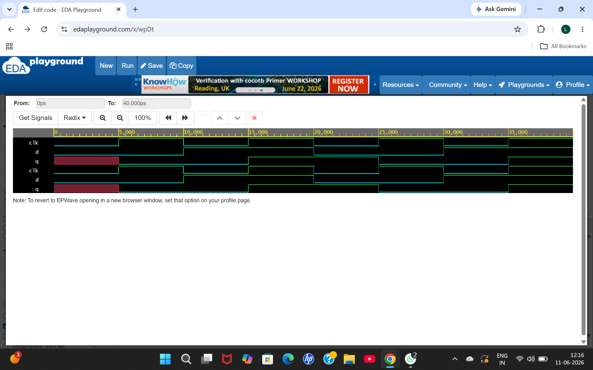
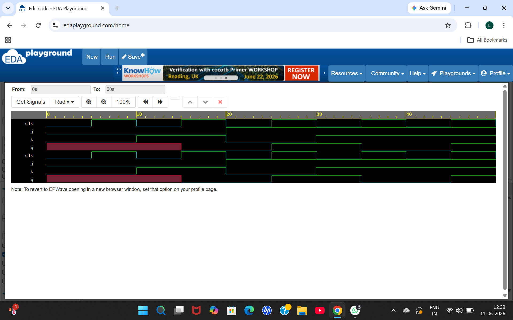
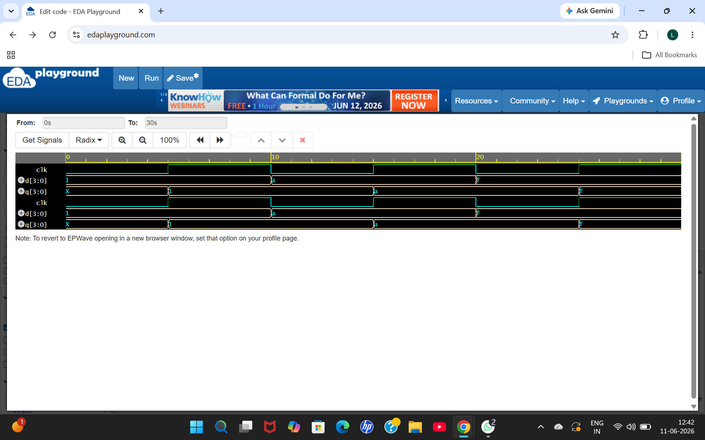
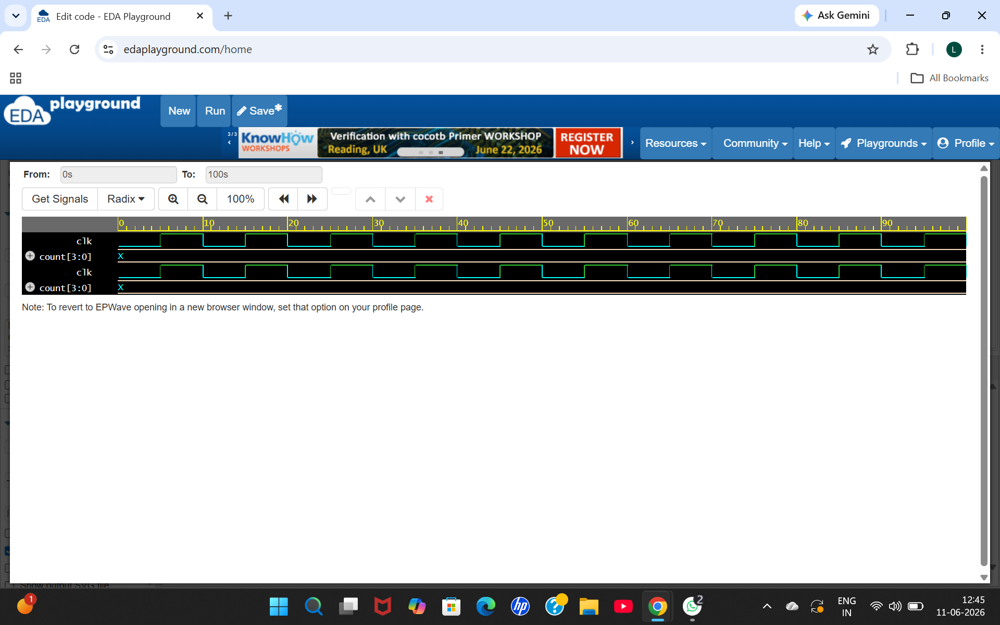

**VLSI Design Internship - Task 3**

**Sequential Circuits and FlipFlops using Verilog RTL**

## Objective

The objective of this task is to design, simulate, and analyze sequential circuits using Verilog HDL. The circuits are implemented and verified using testbenches and waveform analysis. This task helps in understanding the working of flip-flops, registers, and counters, which are fundamental building blocks of digital systems.

## D Flip-Flop
**Description**

A D Flip-Flop is a sequential circuit that stores one bit of data. The output Q takes the value of input D on the rising edge of the clock signal

### Truth Table

| Clock Edge | D | Q(next) |
|------------|---|----------|
| ↑          | 0 | 0        |
| ↑          | 1 | 1        |

### Verilog Code
```verilog
module d_ff(
    input clk,
    input d,
    output reg q
);

always @(posedge clk)
begin
    q <= d;
end

endmodule
```

### Waveform


---

## JK Flip-Flop
### Description

A JK Flip-Flop is a sequential circuit with four operations: hold, reset, set, and toggle.

### Truth Table

| J | K | Q(next) | Operation |
|---|---|----------|-----------|
| 0 | 0 | Q        | No Change |
| 0 | 1 | 0        | Reset     |
| 1 | 0 | 1        | Set       |
| 1 | 1 | Q̅        | Toggle    |

### Verilog Code
```verilog
module jk_ff(
    input clk,
    input j,
    input k,
    output reg q
);

always @(posedge clk)
begin
    case({j,k})
        2'b00: q <= q;
        2'b01: q <= 0;
        2'b10: q <= 1;
        2'b11: q <= ~q;
    endcase
end

endmodule
```

### Waveform


---

## 4-Bit Register
### Description

A 4-bit register stores four bits of data and updates its output on the positive edge of the clock signal.

### Verilog Code
```verilog
module register4(
    input clk,
    input [3:0] d,
    output reg [3:0] q
);

always @(posedge clk)
begin
    q <= d;
end

endmodule
```

### Waveform


---

## 4-Bit Counter
### Description

A 4-bit Binary Counter increments its value by one on every rising edge of the clock signal.

### Counting Sequence

| Clock Pulse | Count |
|-------------|--------|
| 0 | 0000 |
| 1 | 0001 |
| 2 | 0010 |
| 3 | 0011 |
| 4 | 0100 |
| 5 | 0101 |
| ... | ... |

### Verilog Code
```verilog
module counter4(
    input clk,
    output reg [3:0] count
);

always @(posedge clk)
begin
    count <= count + 1;
end

endmodule
```

### Waveform


---

## Tools Used

- Verilog HDL
- EDA Playground
- Icarus Verilog
- GTKWave

### Results

All circuits were successfully designed, simulated, and verified.

✅ D Flip-Flop

✅ JK Flip-Flop

✅ 4-Bit Register

✅ 4-Bit Up Counter

✅ Testbench Verification

✅ Waveform Analysis

## Conclusion

In this task, sequential circuits including a D Flip-Flop, JK Flip-Flop, 4-Bit Register, and 4-Bit Up Counter were successfully designed and simulated using Verilog HDL. The obtained waveforms verified the correct operation of each circuit. This task provided practical experience in sequential logic design, testbench creation, and waveform analysis.
